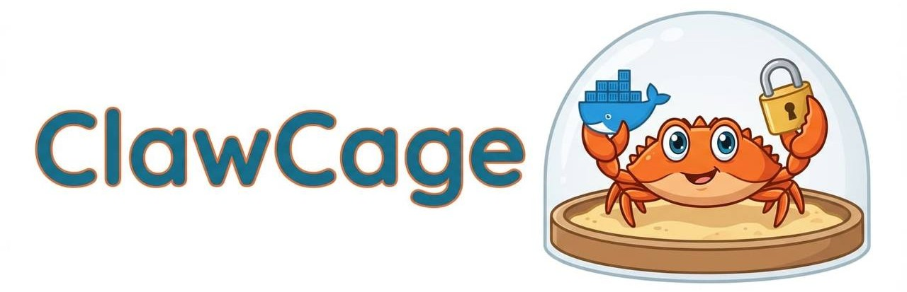

# ClawCage
Secure, zero-trust sandbox and firewall for OpenClaw. Provides maximum isolation for OpenClaw instances running in sensitive network environments.

**Features:**
- Select specific `IP`:`Port`:`Protocol` pairings to allow for OpenClaw. ✅

- Select specific `Domain`:`Port`:`Protocol` pairings to allow. ✅

    - Firewall resolves domains against Cloudflare and Google over TLS and with DNSSEC *(where applicable)* to avoid DNS attacks.
    - Old resolutions are purged upon each refresh.

- Firewall updates every 3 minutes with fresh resolutions ✅

- Support for internal domains resolved using internal DNS servers ✅

#



#

## Quick Start:

Run:
```bash
docker-compose up
```
*That's all it takes!*

Add allowed domains and IPs in `wireguard-fw/allowlist-domains.txt` and `wireguard-fw/allowlist-ips.txt`.
```makefile
# Example: allowlist-domains.txt

# Format: domain:port:protocol
# protocol must be one of {tcp, udp}
#
# Notes:
# The domain is first resolved by refresh.sh into an IP address, and the resulting IP:port:protocol is allowed

openclaw.ai:443:tcp
openclaw.ai:80:tcp
npmjs.com:443:tcp
npmjs.com:80:tcp
registry.npmjs.org:443:tcp
registry.npmjs.org:80:tcp
```

```makefile
# Example: allowlist-ips.txt

# Format: domain:port:protocol
# protocol must be one of {tcp, udp}

10.34.33.25:443:tcp
```

> **Note:** All unspecified endpoints are dropped by the firewall.

## To-Do List:

- Add more protocols (ICMP)
- Add DNS resolution allowlist
- Preinstall OpenClaw in `./openclaw/Dockerfile`